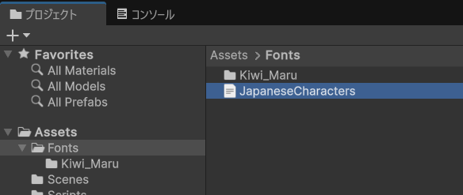
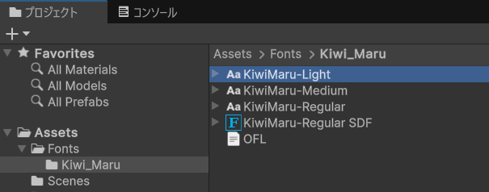
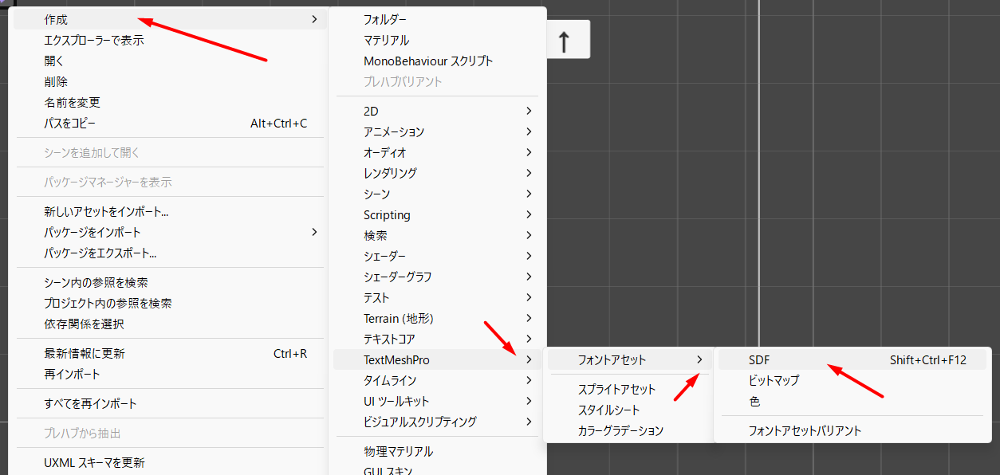
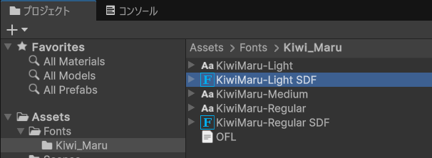
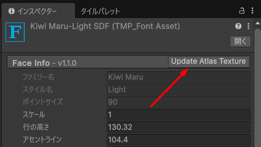
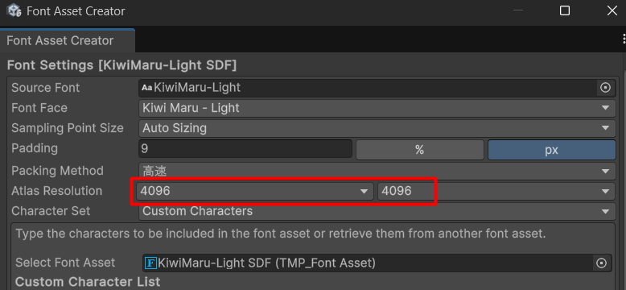
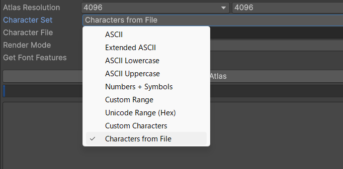
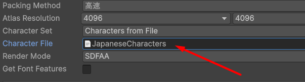
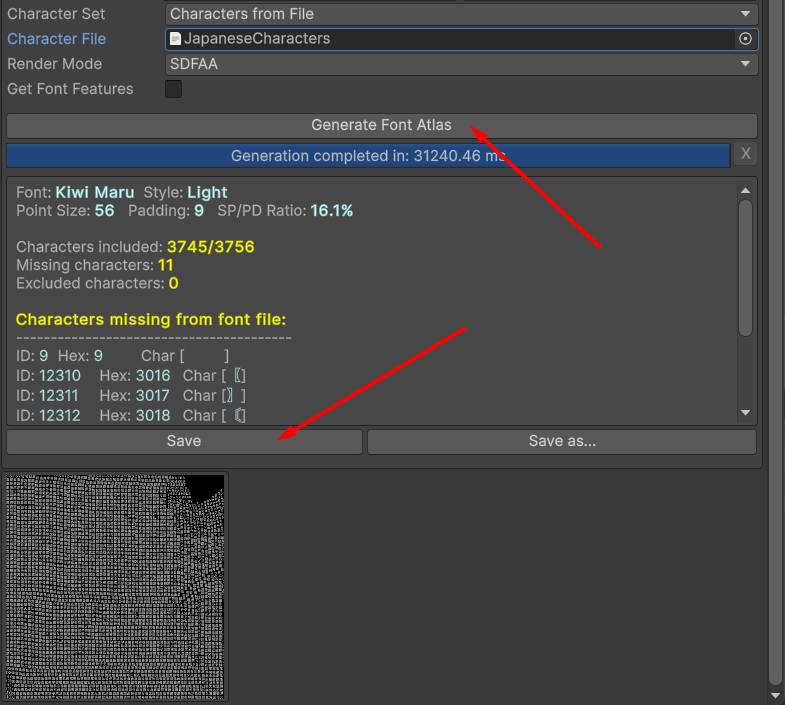

# JapaneseCharacters
主にフォントアセットの作成を目的として、日本語の文章を表示するために必要な文字を集めたテキストファイルです。

## 背景
Unity の Text Mesh Pro では、フォントアセットを作成する際にアトラステクスチャを生成する必要があります。デフォルト設定ではこのテクスチャは自動生成されますが、日本語を表示する場合、文字化けが発生することがあります。この問題を回避するには、使用する文字をあらかじめ明示的に指定する方法が有効です。
しかし、Unicode には多数の漢字や記号が含まれているため、すべてを含めるとアトラステクスチャのサイズが大きくなり、メモリへの負荷が増加します。本テキストファイルは、自然な日本語の文章をほぼ網羅的に表示するために必要な文字を選定・収録したものです。

## 内容について
本テキストファイルには約3,750文字が含まれています。すべて、**ホワイトスペースを除いた印刷可能な文字**です。具体的には以下の通りです：

**ASCII**コード0x21～0x7E：これで半角の英数字および主な句読点がカバーされています。ただし、**拡張ASCIIは含まれていません。** そのため、ダイアクリティカルマーク（à、ö、ñなど）や多くの記号（£、©、½）は含まれていません。例外として、「¥」は含まれています。

```
!"#$%&'()*+,-./0123456789:;<=>?@ABCDEFGHIJKLMNOPQRSTUVWXYZ[\]^_`abcdefghijklmnopqrstuvwxyz{|}~¥
```

使用頻度の低い文字を除いたUnicodeの**日本語句読点**（0x3000～0x303F）：

```
、。〃々〆〇〈〉《》「」『』【】〒〔〕〖〗〘〙〚〛〜〝〞〟
```

**ひらがな**（0x3040～0x309F）：

```
ぁあぃいぅうぇえぉおかがきぎくぐけげこごさざしじすずせぜそぞただちぢっつづてでとどなにぬねの
はばぱひびぴふぶぷへべぺほぼぽまみむめもゃやゅゆょよらりるれろゎわゐゑをん゛゜ゝゞ
```

**カタカナ**（0x30A0～0x30FF）：

```
゠ァアィイゥウェエォオカガキギクグケゲコゴサザシジスズセゼソゾタダチヂッツヅテデトドナニヌネノ
ハバパヒビピフブプヘベペホボポマミムメモャヤュユョヨラリルレロヮワヰヱヲンヴヵヶ・ーヽヾ
```

これらはすべて全角で、**半角カナは含まれていません**。

一部の**全角ローマ字および西洋の句読点**（0xFF00～0xFFEF）：

```
！＂＃＄％＆＇（）＊＋，－．／０１２３４５６７８９：；＜＝＞？＠ＡＢＣＤＥＦＧＨＩＪＫＬＭＮＯ
ＰＱＲＳＴＵＶＷＸＹＺ［＼］＾＿｀ａｂｃｄｅｆｇｈｉｊｋｌｍｎｏｐｑｒｓｔｕｖｗｘｙｚ｛｜｝～｟｠￥
```

残りの文字は使用頻度の高い漢字です。含まれているのは、常用漢字および人名用漢字のほか、以下の文献から集めた文字です：

- [文化庁　漢字出現頻度数調査](https://www.bunka.go.jp/seisaku/bunkashingikai/kokugo/nihongokyoiku_hyojun_wg/04/pdf/91934501_08.pdf)
- Wikipedia出現漢字TOP5000
- Twitter出現漢字TOP5000（Wikipedia同様に、[出典はこちらです](http://www.mwsoft.jp/programming/nlp/cjk_count.html)。）

これら3つのリストのいずれかで順位が3000以下の文字が最終的にリストに含まれました。

最後に、Noto Sans Japaneseなど、よく使われているフォントで対応されていない文字をリストから除外しました。

## Unityでの使い方

本レポジトリから「JapaneseCharacters.txt」をダウンロードします。拡張ASCIIや半角カナなど、含まれていない文字を使用したい場合は、ファイルを編集して追加してください。（どこに挿入しても問題ありません。）



使用するフォントをUnityのプロジェクトに追加します。



フォントを選択した状態で、新規のSDFフォントアセットを作成します。



デフォルトの設定でフォントアセットが生成されます。



フォントアセットのインスペクタで「Update Atlas Texture」を選択します。



アトラステクスチャに含まれる文字数が多いため、テクスチャサイズを大きくします。4096×4096で十分です。



「Character Set」を「Characters from File」に設定します。



「Character File」に「JapaneseCharacters.txt」を指定します。



「Generate Font Atlas」でテクスチャを生成します。フォントに含まれていなかった文字を確認し、「Save」を押して保存します。


